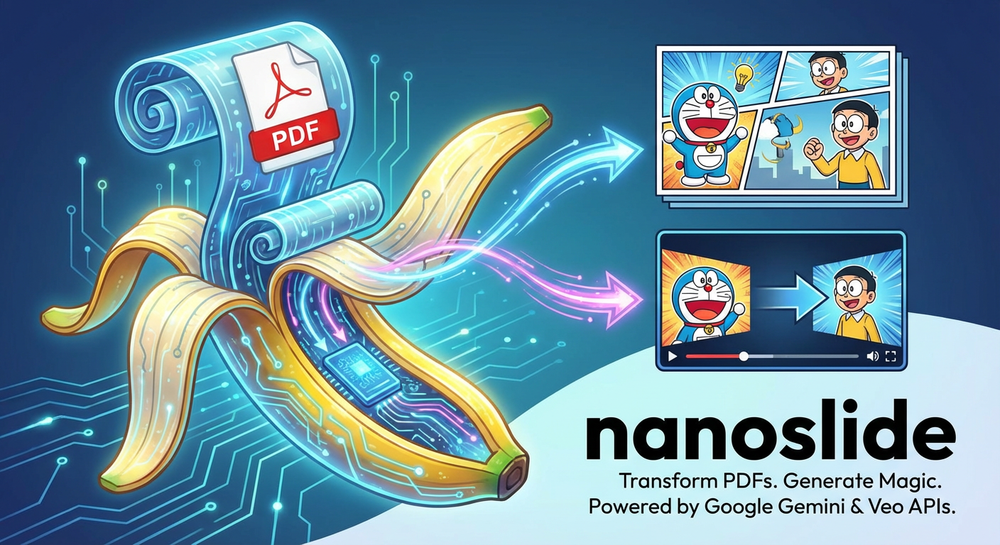

<p align="center">
  
</p>

<p align="center">
  <b>从无趣的PDF到魔法。</b><br>
</p>

<p align="center">
  <a href="README.md">🇬🇧 English</a>
</p>

---

## 功能特点

- 📑 **幻灯片生成**：生成风格化的 PowerPoint 演示文稿。
- 🎬 **视频生成**：创建幻灯片之间的平滑过渡动画。

## 安装

```bash
# 克隆仓库
git clone <repository-url>
cd nanoslide

# 安装依赖
uv install
```

## 配置

使用前需要设置 Google API 密钥：

```bash
export GOOGLE_API_KEY="your-api-key-here"
```

## 使用方法

### 快速开始

一键运行完整流程（从 PDF 到演示文稿和视频）：

```bash
nanoslide pipe examples/transformer.pdf --prompt "蜡笔小新动漫手绘风格，信息密度高，动漫人物形象明显，用中文"
```

### 或者分步执行

#### 1. 生成幻灯片计划

```bash
nanoslide plan examples/transformer.pdf --prompt "你的风格描述"
```

生成 `outputs/transformer/plan.json` 文件。

#### 2. 生成幻灯片

```bash
nanoslide gen-slide examples/transformer.pdf
```

生成幻灯片图片和 PowerPoint 文件：
- `outputs/transformer/slide_pieces/*.png`
- `outputs/transformer/presentation.pptx`

#### 3. 生成视频（可选）

```bash
nanoslide gen-video examples/transformer.pdf
```

生成视频片段：
- `outputs/transformer/video/segment_*.mp4`

#### 4. 融合输出

```bash
nanoslide fuse examples/transformer.pdf
```

合并所有视频片段为完整视频：
- `outputs/transformer/video/fused.mp4`


