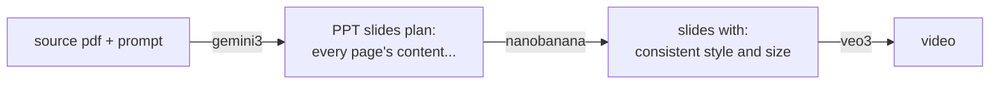

# nanoslide

this is definitely a fucking cool project.

```mermaid
flowchart LR
    A["source pdf + prompt"] --gemini3--> B["PPT slides plan:
    every page's content..."] 
    B --nanobanana--> C["slides with:
    consistent style and size"] 
    C --veo3--> D["video"]
```

